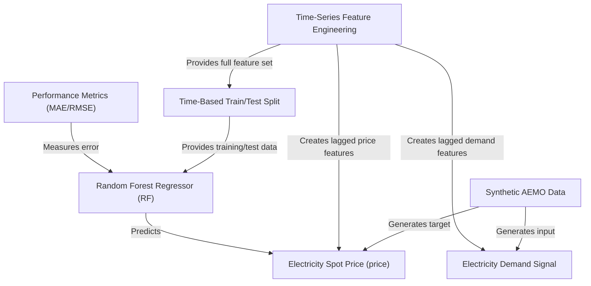
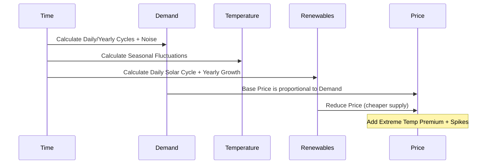
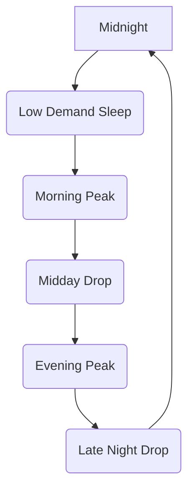
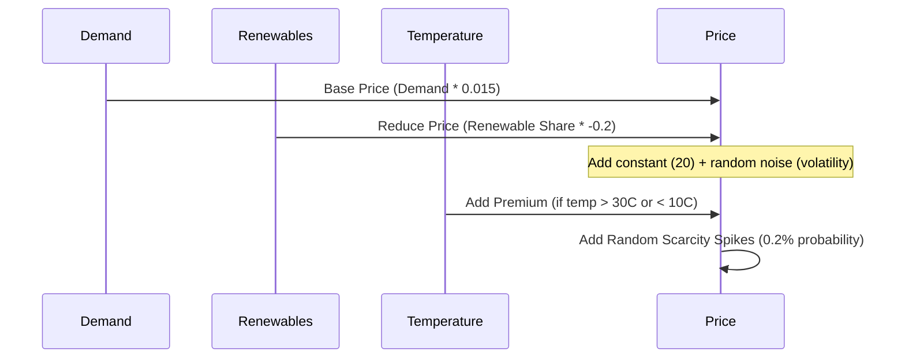
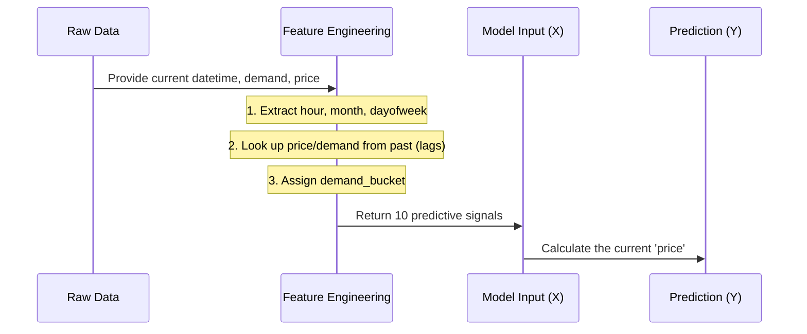
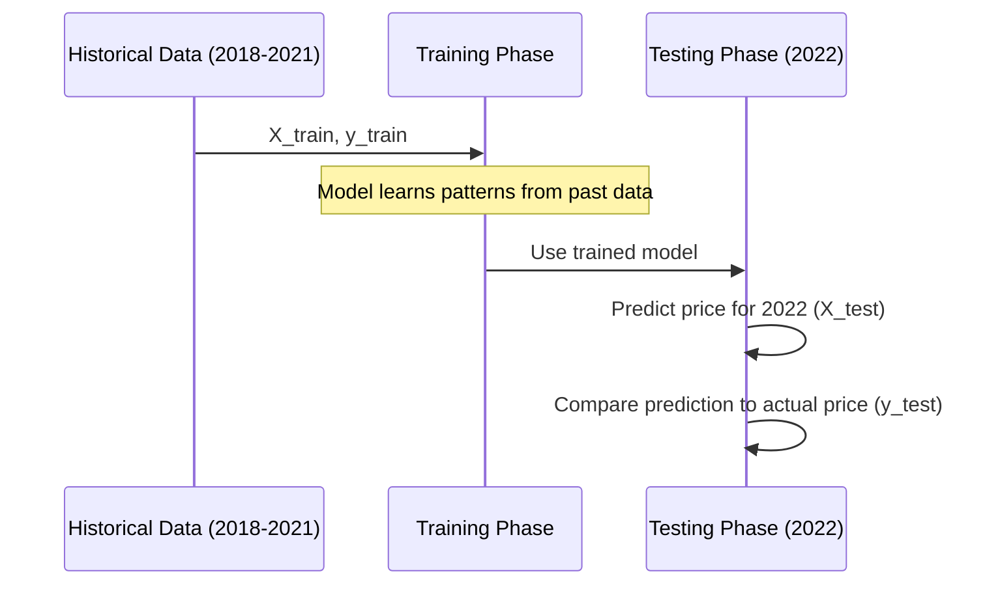
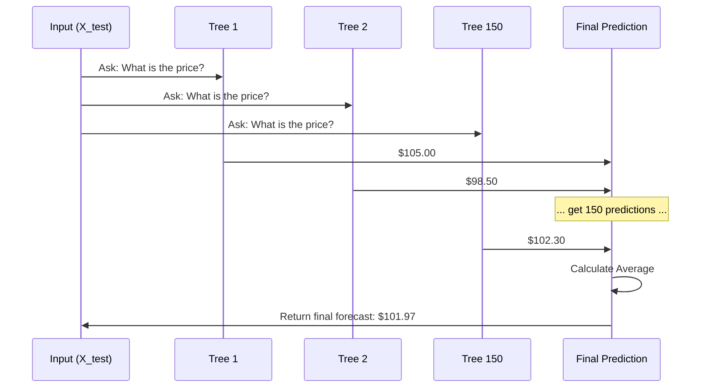
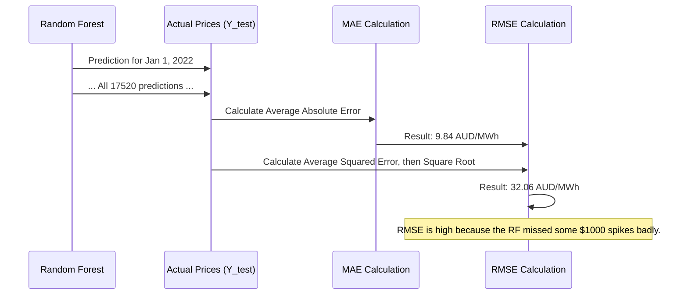

# Tutorial: aemo-qld-price-forecasting

This project simulates an electricity market scenario using **Synthetic AEMO Data** (0) to forecast *volatile 30-minute spot prices* (1) in Queensland. The core process involves **Time-Series Feature Engineering** (2) to build predictive signals from demand (6) and price history, followed by a *Time-Based Train/Test Split* (3). A **Random Forest Regressor** (4) is implemented to handle non-linear patterns and is evaluated rigorously using *Performance Metrics* (5) such as MAE and RMSE.


## Visual Overview



## Chapters

1. [Synthetic AEMO Data
](01_synthetic_aemo_data_.md)
2. [Electricity Demand Signal
](02_electricity_demand_signal_.md)
3. [Electricity Spot Price (`price`)
](03_electricity_spot_price___price___.md)
4. [Time-Series Feature Engineering
](04_time_series_feature_engineering_.md)
5. [Time-Based Train/Test Split
](05_time_based_train_test_split_.md)
6. [Random Forest Regressor (RF)
](06_random_forest_regressor__rf__.md)
7. [Performance Metrics (MAE/RMSE)
](07_performance_metrics__mae_rmse__.md)


# Chapter 1: Synthetic AEMO Data

Welcome to the first chapter! Before we can start forecasting electricity prices, we need data. In real life, getting clean, reliable, and detailed energy market data (like the data published by the Australian Energy Market Operator, or AEMO) can be difficult and often requires complex agreements.

To keep this tutorial focused on *forecasting* and not *data acquisition*, we created a special dataset just for this project: the **Synthetic AEMO Data**.

## The Problem: Training Without Real-World Constraints

Imagine your goal is to build an accurate model to predict tomorrow's electricity price in Queensland (QLD).

**Use Case:** You need a high-quality, continuous dataset that includes all the key factors that influence electricity prices (like temperature, time of day, and demand) over several years.

If we used real data, we might face problems:
1. **Missing Data:** Real data often has gaps or errors.
2. **Complexity:** Real market behavior is incredibly noisy and hard to interpret for a beginner.
3. **Availability:** Licensing or access restrictions might block us.

The Synthetic AEMO Data solves this by providing a clean, easy-to-use simulation that contains the realistic patterns we need to learn time-series forecasting.

## What is Synthetic AEMO Data?

This is a simulated dataset of the Queensland (QLD1) electricity market. It mimics real-world data characteristics, such as:

1. **High Frequency:** It records data every 30 minutes.
2. **Seasonality:** Prices and demand are higher in summer (for air conditioning) and show predictable daily patterns (morning/evening peaks).
3. **External Drivers:** It includes features like temperature and the amount of renewable energy being generated.
4. **Volatility:** Crucially, it includes random, sharp price spikes that mimic scarcity events in the real market.

This dataset is the foundational `pandas` DataFrame we will use for the rest of the project.

---

### Key Data Components

Our synthetic dataset is structured like a typical time-series power market file. Here are the key columns:

| Column | Role | Real-World Analog |
| :--- | :--- | :--- |
| `datetime` | The time stamp (30-minute intervals). | When the reading occurred. |
| `region` | Always 'QLD1' (Queensland). | The specific market location. |
| `demand_mw` | Total electricity usage (Megawatts). | A key driver of price. |
| `temperature_c` | Ambient temperature (Celsius). | Drives demand (AC/heating). |
| `renewable_share` | Percentage of generation from renewables. | Higher share usually means cheaper power. |
| `price` | The spot price (AUD/MWh). | The value we are trying to predict. |

---

## Getting Started: Loading the Data

To solve our use case—forecasting QLD electricity prices—the first step is always loading and inspecting this foundational data.

We start by importing the necessary libraries (`pandas`) and loading the pre-generated file, `synthetic_qld_power_data.csv`.

```python
import pandas as pd
import matplotlib.pyplot as plt

# 1. Load data
df = pd.read_csv("synthetic_qld_power_data.csv")

# 2. Convert the 'datetime' column to the proper type
df["datetime"] = pd.to_datetime(df["datetime"])

# 3. Sort by time (crucial for time-series)
df = df.sort_values("datetime")

# Show the first few rows
print(df.head())
```

**What the code does:**
1. Loads the data into a DataFrame named `df`.
2. Converts the `datetime` column from a general text format (object) to a specialized time format. This is necessary for all subsequent time-series analysis.
3. Ensures the data is ordered correctly by time, from oldest to newest.

**Example Output (First 5 Rows):**
```
             datetime region    demand_mw  temperature_c  renewable_share  \
0 2018-01-01 00:00:00   QLD1  4929.985428      28.472395         5.000000   
1 2018-01-01 00:30:00   QLD1  4787.649040      25.154093         5.458463   
2 2018-01-01 01:00:00   QLD1  4926.106131      22.658468         8.317144   
3 2018-01-01 01:30:00   QLD1  5079.368674      25.789393        13.991909   
4 2018-01-01 02:00:00   QLD1  4703.427165      25.809169        17.970418   

       price  
0  82.608483  
1  88.277969  
2  99.087859  
3  95.817817  
4  88.666726  
```

## How the Data is Generated (Under the Hood)

It's helpful to know that the data isn't random noise; it's built using simple, stacked mathematical formulas. This ensures our data exhibits the realistic cycles required for good forecasting.

The core relationship in energy markets is that **Price is driven by Demand and Supply (Renewable Share)**.

### Simplified Flow of Data Generation

The data generation script first creates the time index, and then calculates each column sequentially:



### The Price Calculation (Internal Logic)

The final price column, which is our target variable (what we want to predict), is essentially built from three main influences:

1. **Base Price:** A positive relationship with `demand_mw` (high demand means high price) and a negative relationship with `renewable_share` (high renewables means lower price).
2. **Temperature Premium:** If the temperature is very high or very low, a fixed extra cost is added (simulating high cooling or heating load stress).
3. **Scarcity Spikes:** Small, random price spikes are added occasionally to mimic unexpected outages or rapid market shifts.

This structure means that if our model can accurately predict demand, temperature, and renewable share, it should be able to make a great prediction for the final [Electricity Spot Price (`price`)](03_electricity_spot_price___price___.md).

### Example Code Snippet: Price Calculation

Here is a simplified look at the actual Python logic used to create the final price column (from the source notebook):

```python
# ---------------- Price (AUD/MWh) ----------------
# Base price using demand and renewables
base_price = (
    20
    + 0.015 * df["demand_mw"]
    - 0.2   * df["renewable_share"]
)

# Extreme temp premium (15 AUD/MWh if temp is extreme)
temp_premium = np.where(
    (df["temperature_c"] > 30) | (df["temperature_c"] < 10),
    15,
    0,
)

# Occasional price spikes
spike_prob = 0.002 
spike_mask = np.random.rand(n) < spike_prob
spikes = spike_mask * np.random.uniform(200, 1000, size=n)

price = base_price + temp_premium + volatility + spikes
```

This code snippet confirms that the `price` is a function of the other columns, making our forecasting task one of discovering and modeling these relationships.

---

## Conclusion and Next Steps

We have successfully loaded our foundation dataset, the Synthetic AEMO Data. We understand that this data is designed to mimic real-world energy market complexity by simulating key drivers like demand, temperature, and renewable penetration, which ultimately determine the target variable: `price`.

The core challenge now is figuring out how the different features in this dataset (like demand and time) influence the price we want to predict.

In the next chapter, we will dive deeper into the single most important feature in this dataset: the [Electricity Demand Signal](02_electricity_demand_signal_.md).

[Electricity Demand Signal](02_electricity_demand_signal_.md)

# Chapter 2: Electricity Demand Signal

Welcome back! In [Synthetic AEMO Data](01_synthetic_aemo_data_.md), we learned that our target (`price`) is strongly influenced by key features, especially `demand_mw`.

In this chapter, we will focus entirely on understanding this core feature: the **Electricity Demand Signal**.

---

## Why Demand Drives the Price

Electricity is unique because it is difficult (or expensive) to store. It must be generated and consumed almost instantaneously. This means that the price is highly sensitive to the balance between **Supply** and **Demand**.

The `demand_mw` column measures the total amount of electricity consumers are using in Queensland at any 30-minute interval, measured in Megawatts (MW).

**Use Case:** We want to predict if the price will increase sharply in the next 30 minutes.

If demand suddenly increases, generators might struggle to ramp up supply quickly enough. This scarcity causes the price to spike. Therefore, knowing the current and recent demand levels is the single most important piece of information for our forecasting model.

---

## Understanding Demand Cycles

Electricity demand is not random; it follows predictable human behavior. We need to understand these patterns to build useful features for our model.

The synthetic data is built with two main cycles:

### 1. Daily Cycles (Morning and Evening Peaks)

Think about a typical workday. When do people use the most power?

*   **Morning Peak (7 AM - 9 AM):** People wake up, make coffee, toast, and turn on lights/heating/AC.
*   **Daytime Drop (10 AM - 4 PM):** Many people are away from home, and solar power generation is highest, reducing the need for grid power.
*   **Evening Peak (5 PM - 8 PM):** People return home, start cooking, turn on the TV, and ramp up heating or cooling.

This daily rhythm creates a strong, recurring signal that our model must learn:



### 2. Yearly Seasonality

The base level of demand changes dramatically depending on the season, especially in a subtropical region like Queensland:

| Season | Demand Driver | Effect on `demand_mw` |
| :--- | :--- | :--- |
| **Summer** | Air conditioning (cooling load) | High average demand |
| **Winter** | Heating load (though less than AC) | Moderate to High average demand |
| **Spring/Autumn** | Mild weather | Lowest average demand |

---

## Engineering the Lagged Demand Feature

To solve our use case (predicting the next 30 minutes' price), simply providing the model with the *current* demand is not enough. We need to tell the model: "What was the demand 30 minutes ago?"

We call this a **lagged feature**, and it acts as a measure of recent momentum.

**Analogy:** If you are forecasting the speed of a car in the next second, knowing its speed one second ago is often the best single predictor, because acceleration is usually gradual.

In our 30-minute data, we create `demand_lag_1`, which is the `demand_mw` value from the previous observation. As noted in the project insights, this is one of the strongest drivers of short-term price movement.

### Creating `demand_lag_1`

We use the Pandas `.shift(1)` method to move the `demand_mw` column down by one row (or one 30-minute time step).

First, let's ensure our DataFrame (`df`) is indexed by time, as established in the last chapter:

```python
# The index must be the 'datetime' for time-series operations
df = df.set_index("datetime") 

# Now, create the lagged demand feature
# .shift(1) takes the current demand value and moves it to the next time step.
df["demand_lag_1"] = df["demand_mw"].shift(1)

# Display the result (only relevant columns and top rows)
print(df[["demand_mw", "demand_lag_1"]].head(5))
```

**Example Output:**

| datetime | demand_mw | demand_lag_1 |
| :--- | :--- | :--- |
| 2018-01-01 00:00:00 | 4929.98 | NaN |
| 2018-01-01 00:30:00 | 4787.64 | 4929.98 |
| 2018-01-01 01:00:00 | 4926.10 | 4787.64 |
| 2018-01-01 01:30:00 | 5079.36 | 4926.10 |
| 2018-01-01 02:00:00 | 4703.42 | 5079.36 |

**What the code does:**
1.  In the first row (00:00:00), `demand_lag_1` is `NaN` because there is no prior data point.
2.  In the second row (00:30:00), the `demand_lag_1` value (4929.98) is the `demand_mw` from the previous row (00:00:00).
3.  This feature now provides our model with the immediate past context of electricity usage.

We will use this same lagging technique later for the price itself, as seen in the [Time-Series Feature Engineering](04_time_series_feature_engineering_.md) chapter.

---

## Conclusion and Next Steps

We have established that the **Electricity Demand Signal** (`demand_mw`) is the most critical feature in our dataset, governed by predictable daily and yearly cycles. Crucially, we have engineered `demand_lag_1`, which captures the short-term momentum required for accurate 30-minute price predictions.

Now that we understand the primary driver, we need to focus on the target itself—the electricity spot price—and how its volatility makes prediction difficult.

Our next chapter will dive into the nature of the target variable: the [Electricity Spot Price (`price`)](03_electricity_spot_price___price___.md).

# Chapter 3: Electricity Spot Price (`price`)

Welcome back! In the previous chapter, [Electricity Demand Signal](02_electricity_demand_signal_.md), we focused on the most critical input to our forecast: electricity demand (`demand_mw`). Now, we shift our focus to the output—the target variable we must predict: the **Electricity Spot Price (`price`)**.

## What is the Spot Price?

The `price` column is the most important part of our dataset. It represents the wholesale price of electricity in Queensland, measured in Australian Dollars per Megawatt-hour (AUD/MWh).

In the real world, this price changes every 30 minutes, and the market operators (`AEMO` in Australia) are constantly forecasting what the price will be for the next 30-minute block.

**Use Case:** We need to predict the exact magnitude of the price in the next 30-minute interval (the target variable, `price`).

Accurate prediction is crucial for big energy users and generators, as the price swings can be huge, turning a profit into a loss in just half an hour.

## 1. The Components of Price

As we saw briefly in Chapter 1, the `price` in our synthetic dataset is built from three main, realistic components. Understanding these components is key to understanding why our model needs the features we are creating.

| Component | Description | Primary Drivers | Volatility |
| :--- | :--- | :--- | :--- |
| **Base Price** | The cost of generation under normal conditions. | `demand_mw` (high demand = higher base price) and `renewable_share` (high renewables = lower price). | Low to Moderate |
| **Temperature Premium** | A fixed cost added during extreme weather. | `temperature_c` (especially high/low values). | Low (Fixed amount) |
| **Scarcity Spikes** | Sudden, massive, but rare price increases simulating emergencies (e.g., generator failure). | Random events. | Very High |

The average price is around $80–$100 AUD/MWh, but during scarcity spikes, it can jump to several hundred dollars.

## 2. The Volatility Problem

When we look at the price data over a full year, we see a key challenge for any forecasting model: **volatility**.

Let's load the data, set the index, and look at the statistical summary of the `price` column.

```python
import pandas as pd

# Load data and convert datetime, as done in Chapter 1
df = pd.read_csv("synthetic_qld_power_data.csv")
df["datetime"] = pd.to_datetime(df["datetime"])
df = df.sort_values("datetime").set_index("datetime")

# Look at the statistics for the 'price' column
print(df["price"].describe())
```

**Example Output (Statistics):**

```
count    87648.000000
mean        95.120300
std         45.011800
min        -20.000000
25%         70.354000
50%         89.456000
75%        114.789000
max       1000.000000
Name: price, dtype: float64
```

**What this tells us:**
1. **Mean:** The average price is about $95/MWh.
2. **Standard Deviation (Std):** This is high ($45), showing the data is very spread out.
3. **Max:** The maximum price is $1,000/MWh! These are the scarcity spikes.

Forecasting a value that normally sits around $95, but occasionally jumps 10 times higher, is the hardest part of the project.

## 3. Engineering Lagged Price Features

In [Electricity Demand Signal](02_electricity_demand_signal_.md), we learned that the *immediate past* is a powerful predictor. If the price is high right now, it is likely to remain high in the next 30 minutes, because market conditions (like high demand or low supply) rarely disappear instantly.

To help our model solve the use case (predicting the next 30-minute price), we must include the price from the *last* interval as a feature. This is called the **Lag-1 Price**.

We also know that energy prices have strong daily cycles. The price today at 8:00 AM is usually very similar to the price yesterday at 8:00 AM. Since our data is 30-minute resolution, a full day is $24 \text{ hours} \times 2 \text{ intervals/hour} = 48$ intervals. We create a **Lag-48 Price** feature for seasonality.

### Creating `price_lag_1` and `price_lag_48`

We use the Pandas `.shift()` method again:

```python
# Create the lagged price features
df["price_lag_1"] = df["price"].shift(1)
df["price_lag_48"] = df["price"].shift(48)

# Show the result (first few rows)
print(df[["price", "price_lag_1", "price_lag_48"]].head(5))

# We drop rows with NaN values introduced by the shift
df_model = df.dropna().copy()
print(f"\nTotal rows after dropping NaNs: {len(df_model)}")
```

**Example Output (First 5 Rows):**

| datetime | price | price_lag_1 | price_lag_48 |
| :--- | :--- | :--- | :--- |
| 2018-01-01 00:00:00 | 82.60 | NaN | NaN |
| 2018-01-01 00:30:00 | 88.27 | 82.60 | NaN |
| 2018-01-01 01:00:00 | 99.08 | 88.27 | NaN |
| 2018-01-01 01:30:00 | 95.81 | 99.08 | NaN |
| 2018-01-01 02:00:00 | 88.66 | 95.81 | NaN |

The `NaN` values in the first 48 rows mean the model cannot use these initial data points, as they lack the necessary historical context.

## 4. How the Price Spikes are Generated (Under the Hood)

Let's review the synthetic mechanism that creates the volatility we just observed.

The final price is the sum of predictable trends (driven by demand, renewables, and temperature) plus the random, high-impact scarcity spikes.

### Internal Logic Flow: Calculating Price

This is the simplified sequence of how the price is calculated for a single 30-minute interval:



The synthetic code snippet from [Synthetic AEMO Data](01_synthetic_aemo_data_.md) confirms the calculation of these spikes:

```python
# ---------------- Price Spikes Logic ----------------

# 1. Define how often spikes happen (0.002 = 0.2% of the time)
spike_prob = 0.002 
n = len(df) # total number of data points

# 2. Randomly select which time steps get a spike
spike_mask = np.random.rand(n) < spike_prob

# 3. If a spike happens, assign a large random value (200 to 1000)
spikes = spike_mask * np.random.uniform(200, 1000, size=n)

# 4. Final price includes these spikes
# price = base_price + temp_premium + volatility + spikes 
```

**Why this matters:** The model must learn the complex relationships that define the `base_price` (using demand, renewables, and time features like our lagged features), but it will struggle with the `scarcity spikes`, since they are intentionally random and unpredictable, just like in the real world. Our goal is to minimize the error everywhere, even on these extreme points.

---

## Conclusion and Next Steps

We have successfully identified the **Electricity Spot Price (`price`)** as our key forecasting target. We understand its three main components, the challenge of extreme volatility (spikes), and we have engineered two powerful time-series features (`price_lag_1` and `price_lag_48`) to capture its immediate momentum and daily seasonality.

The dataset now contains multiple features that provide temporal context and information about the underlying supply/demand balance. Our next step is to prepare the remaining time-based features to fully utilize the cyclic nature of this energy data.

[Time-Series Feature Engineering](04_time_series_feature_engineering_.md)

# Chapter 4: Time-Series Feature Engineering

Welcome back! In the previous chapters, we loaded our [Synthetic AEMO Data](01_synthetic_aemo_data_.md) and identified the core signals: [Electricity Demand Signal](02_electricity_demand_signal_.md) (`demand_mw`) and the target [Electricity Spot Price (`price`)](03_electricity_spot_price___price___.md). We also created a few basic lagged features like `price_lag_1` and `demand_lag_1`.

Now, we need to complete the process of **Feature Engineering**. This is the art of transforming raw data (like a timestamp or a demand number) into powerful predictive signals that our machine learning model can actually understand.

## The Problem: Making Time Meaningful

A computer model doesn't inherently understand that 8:00 AM is a time of high energy demand or that summer has higher demand than autumn. It only sees a `datetime` object or a `demand_mw` number.

**Use Case:** We want our model to recognize predictable daily and seasonal patterns automatically, because these cycles are the primary drivers of price.

To solve this, we must break down the raw time data and the demand data into simple, measurable features.

---

## 1. Extracting Time Components (Calendar Features)

The most important patterns in energy markets are driven by the clock and the calendar. We extract these components directly from the `datetime` index.

| Feature | What it Represents | Why it Matters |
| :--- | :--- | :--- |
| `hour` | The time of day (0-23.5) | Captures morning/evening price peaks. |
| `dayofweek` | Which day it is (0=Monday, 6=Sunday) | Demand is usually lower on weekends. |
| `month` | Which month it is (1-12) | Captures yearly seasonality (summer heat vs. mild autumn). |

### Code: Creating Calendar Features

First, we ensure the `datetime` column is the DataFrame index, as required for time-series operations in Pandas:

```python
import pandas as pd

# 1. Load the existing data (including lags from Chapter 3)
df = pd.read_csv("synthetic_qld_power_data.csv")
df["datetime"] = pd.to_datetime(df["datetime"])
df = df.sort_values("datetime").set_index("datetime")

# Add the lags first (as done in Chapter 3)
df["price_lag_1"] = df["price"].shift(1)
df["price_lag_48"] = df["price"].shift(48)
df["demand_lag_1"] = df["demand_mw"].shift(1)


# 2. Extract Time Features
df["hour"] = df.index.hour + df.index.minute / 60
df["dayofweek"] = df.index.dayofweek
df["month"] = df.index.month

# Display the new features
print(df[["hour", "dayofweek", "month"]].head())
```

**Example Output (First 5 Rows):**

| datetime | hour | dayofweek | month |
| :--- | :--- | :--- | :--- |
| 2018-01-01 00:00:00 | 0.0 | 0 | 1 |
| 2018-01-01 00:30:00 | 0.5 | 0 | 1 |
| 2018-01-01 01:00:00 | 1.0 | 0 | 1 |
| 2018-01-01 01:30:00 | 1.5 | 0 | 1 |
| 2018-01-01 02:00:00 | 2.0 | 0 | 1 |

**What the code does:**
We use the `.dt` accessor (for datetime index) to grab the hour, day of the week, and month directly. Note that 00:30:00 becomes 0.5 hours.

---

## 2. Creating the Demand Bucket (Composite Feature)

The raw `demand_mw` number (e.g., 5000 MW) is useful, but the *context* of that number is even more powerful. Is 5000 MW high for this market? Is it low?

A **composite feature** is one that combines or categorizes information from an existing column to provide context. We create a `demand_bucket` feature that tells the model whether the current demand is very low, moderate, high, or very high, compared to the entire historical range.

We use **quantiles** (percentiles) to divide the historical demand into four equal groups (buckets 0, 1, 2, 3).

| Demand Bucket | Interpretation | Price Expectation |
| :--- | :--- | :--- |
| **0** (Lowest 25%) | Very Low Demand | Low |
| **1** (25% to 50%) | Moderate-Low Demand | Moderate |
| **2** (50% to 75%) | Moderate-High Demand | High |
| **3** (Highest 25%) | Very High Demand | Very High (risk of spikes) |

By converting the raw number into a categorical bucket, we make it easier for our [Random Forest Regressor (RF)](06_random_forest_regressor__rf__.md) to learn the non-linear relationship: prices react drastically differently when demand moves from bucket 2 (high) to bucket 3 (very high) than when it moves from bucket 0 to 1.

### Code: Creating the Demand Bucket

We use `pd.qcut` (quantile cut) to divide the `demand_mw` column into 4 equally sized bins:

```python
# Create the demand level bucket feature
# pd.qcut automatically finds the boundaries that split the data into 4 groups
df["demand_bucket"] = pd.qcut(df["demand_mw"], 4, labels=[0, 1, 2, 3])

# Inspect the result
print(df[["demand_mw", "demand_bucket"]].head())

# Check the distribution of demand buckets
print(df["demand_bucket"].value_counts())
```

**What the code does:**
`pd.qcut` calculates the boundaries (e.g., 4000 MW might be the boundary between 0 and 1) such that 25% of all data points fall into each bin. This provides a robust measure of whether the current demand is unusually high or low for the QLD market.

## 3. The Full Feature Set

After this chapter and the previous ones, our DataFrame now contains a rich set of features that incorporate three crucial elements for forecasting:

1.  **Immediate History (Lags):** `price_lag_1`, `demand_lag_1`
2.  **Daily/Seasonal Cycles (Calendar):** `hour`, `dayofweek`, `month`
3.  **Fundamental Drivers (Real-time):** `demand_mw`, `temperature_c`, `renewable_share`, `demand_bucket`

### Data Preparation Summary

Finally, we must clean up any missing values introduced by the lagged features. Since `price_lag_48` requires 48 prior data points (a full day of data), the first 48 rows of our DataFrame will have `NaN` values. We drop these rows to prepare the final model-ready dataset, `df_model`.

```python
# Drop rows with NaN values introduced by the shift operations
df_model = df.dropna().copy()

# Print the final list of features we will use (The X variables)
feature_cols = [
    "price_lag_1",
    "price_lag_48",
    "demand_mw",
    "demand_lag_1",
    "temperature_c",
    "renewable_share",
    "hour",
    "dayofweek",
    "month",
    "demand_bucket",
]

print(f"Total features ready for modeling: {len(feature_cols)}")
```

## How Feature Engineering Works (Under the Hood)

Feature engineering transforms the time-series forecasting problem into a supervised learning problem (like standard classification or regression).

When we train our model in a later chapter, it will use all the features we just created (X variables) to predict the price (`price`, the Y variable) *at the current time step*.

### Logic Flow for Prediction



By providing the model with `price_lag_48` and the `hour` feature, for example, the model can learn: "If the price was high yesterday at this exact hour, and the current hour is 8.0 (morning peak), the price will likely be high now."

---

## Conclusion and Next Steps

We have successfully engineered a rich feature set for our electricity price forecasting model. We now have lagged price/demand features, time components (hour, day of week, month), and a composite demand context (`demand_bucket`).

Our data is now fully prepared, ordered by time, and contains all the historical and temporal context needed to make accurate predictions. The next crucial step is to split this data into training and testing sets in a way that respects the flow of time.

[Time-Based Train/Test Split](05_time_based_train_test_split_.md)


# Chapter 5: Time-Based Train/Test Split

Welcome back! In [Time-Series Feature Engineering](04_time_series_feature_engineering_.md), we successfully created a rich dataset, `df_model`, which contains all the historical data and predictive features (like lagged prices and time components).

Before we train our first model, we need to answer a fundamental question: **How do we know if our model is actually good at predicting the future?**

This chapter introduces the concept of a **Time-Based Train/Test Split**, the critical step that ensures our evaluation accurately mimics real-world forecasting.

---

## The Problem: Training on the Future

In standard machine learning, you usually split your data randomly into training and testing sets.

**But time series data is different.**

Imagine we randomly split our 4 years of electricity data (2018–2022). The model might train using price data from **January 2022** and then be tested on data from **January 2018**.

*   This is cheating!
*   The model would know the future (2022) when it tries to predict the past (2018).
*   In the real world, you only have data up to the moment you make the forecast.

**Use Case:** We want to train a model using all historical data available (2018–2021) and then evaluate its performance on a period it has never seen (2022), simulating a live forecasting scenario.

To solve this, we must maintain the **chronological order** of the data.

## 1. Time-Based Splitting: The Golden Rule

The golden rule of time-series splitting is:

> **The test data must always occur chronologically AFTER the training data.**

We will divide our data into two distinct blocks:

| Set | Purpose | Time Range |
| :--- | :--- | :--- |
| **Training Set** | Used to teach the model patterns and relationships (e.g., how demand affects price). | January 2018 – December 2021 (The historical past) |
| **Testing Set** | Used to evaluate how well the model predicts prices it has never seen before. | January 2022 – December 2022 (The most recent past, acting as the future) |

By reserving the entire year of 2022 for testing, we ensure our model is only evaluated on data points that occurred chronologically *after* the training phase finished, just like a real energy forecast.

## 2. Implementing the Split in Python

We will use the Pandas `DateOffset` functionality to quickly define our splitting point: the start of the final year (2022).

We use the `df_model` DataFrame created in the previous chapter, which already has the `datetime` as its index.

### Step 1: Define the Split Date

We find the last date in our dataset (`df_model.index.max()`) and subtract one full year. This gives us the exact date boundary between the training data and the test data.

```python
# Assume df_model contains data from 2018-01-01 to 2022-12-31 23:30:00

import pandas as pd
# Reloading the data and features is assumed (from Chapter 4)
# df_model = ... # (A DataFrame with datetime index, filled features, and no NaNs)

# Calculate the split date (1 year before the end)
split_date = df_model.index.max() - pd.DateOffset(years=1)

print(f"Total rows in df_model: {len(df_model)}")
print(f"Data will be split before: {split_date}")
```

**Example Output:**
```
Total rows in df_model: 87600
Data will be split before: 2021-12-31 23:30:00
```
This confirms that data *before or on* this date is training data, and data *after* this date is test data.

### Step 2: Split the DataFrames

Now we use standard Pandas indexing to filter the `df_model` into two separate DataFrames: `train` and `test`.

```python
# The training set includes all data BEFORE or ON the split date
train = df_model[df_model.index <= split_date]

# The test set includes all data AFTER the split date
test  = df_model[df_model.index  > split_date]

print(f"Training set size: {len(train)} rows")
print(f"Testing set size:  {len(test)} rows")
```

**What the code does:** It strictly separates the historical data (train) from the most recent data (test). The training set now holds data from 2018, 2019, 2020, and 2021, and the testing set holds all of 2022.

## 3. Separating Features (X) and Target (Y)

For machine learning models, we need to explicitly separate the inputs (features, $X$) from the output we want to predict (the target, $Y$).

Recall the features we engineered in [Time-Series Feature Engineering](04_time_series_feature_engineering_.md):

```python
feature_cols = [
    "price_lag_1",
    "price_lag_48",
    "demand_mw",
    "demand_lag_1",
    "temperature_c",
    "renewable_share",
    "hour",
    "dayofweek",
    "month",
    "demand_bucket",
]
# The target variable (Y) is always the current price
target_col = "price" 
```

We now create the final four datasets needed for model training: $X_{train}$, $Y_{train}$, $X_{test}$, and $Y_{test}$.

```python
# 1. Training Inputs (Features) and Output (Target)
X_train = train[feature_cols]
y_train = train[target_col]

# 2. Testing Inputs (Features) and Expected Output (Target)
X_test  = test[feature_cols]
y_test  = test[target_col]

print(f"X_train shape: {X_train.shape}")
print(f"y_test shape:  {y_test.shape}")
```

**What the code does:** $X_{train}$ contains the historical data the model will learn from, and $Y_{test}$ contains the actual prices from 2022 that we will try to predict.

## 4. Visualizing the Time-Based Split

This method is crucial because it mimics the real process of deploying a model. The training boundary acts as the "deployment date" in our simulation.

### Logic Flow

The flow below illustrates how the model only uses data from the past to make predictions on the future.



The success of the model is measured *only* by its ability to predict $Y_{test}$ using the features in $X_{test}$, without ever having seen $Y_{test}$ during training.

---

## Conclusion and Next Steps

We have successfully performed a time-based train/test split, preparing our data for the core machine learning task. This split ensures that our model evaluation is realistic, preventing "data leakage" where future information might inadvertently influence training.

Our data sets are now ready: we have $X_{train}$ and $Y_{train}$ for teaching the model, and $X_{test}$ and $Y_{test}$ for evaluation.

The next step is to introduce the machine learning model we will use to learn the complex relationships between demand, time, and price.

[Random Forest Regressor (RF)](06_random_forest_regressor__rf__.md)


# Chapter 6: Random Forest Regressor (RF)

Welcome back! In the previous chapter, we finished preparing our data by performing a [Time-Based Train/Test Split](05_time_based_train_test_split_.md). We now have four ready-to-use datasets: $X_{train}$ (historical features), $Y_{train}$ (historical prices), $X_{test}$ (future features), and $Y_{test}$ (future actual prices).

We previously tested a simple Linear Regression model, which assumes the relationship between demand, time, and price is a straight line. But as we saw in [Electricity Spot Price (`price`)](03_electricity_spot_price___price___.md), electricity prices are highly volatile and non-linear (i.e., they spike randomly).

Linear Regression struggles with these complex, non-linear patterns. To improve our forecast, we need a more powerful model.

## What is a Random Forest Regressor (RF)?

The **Random Forest Regressor (RF)** is a powerful machine learning model designed to handle complex relationships, especially in data with high volatility, like energy prices.

### Use Case: Beating the Simple Models

Our goal is to accurately predict the next 30-minute electricity price (`price`) better than the simple baseline models (Naive and Linear Regression).

The Random Forest does this by using the "wisdom of crowds" principle.

### Key Concept: The Decision Tree

Before understanding the "Forest," we must understand the "Tree." A **Decision Tree** is a simple model that makes a prediction by asking a series of yes/no questions about the data.

Imagine forecasting the price at 8:30 AM:

1.  **Question 1:** Is `price_lag_1` (the price 30 mins ago) above $100?
    *   *If Yes:* Go to the next question.
    *   *If No:* Predict the price is $85.
2.  **Question 2:** Is the `demand_bucket` (Chapter 4) "Very High"?
    *   *If Yes:* Predict the price is $150.
    *   *If No:* Predict the price is $105.

A single Decision Tree can easily model non-linear rules (like "If demand is high *and* temperature is low, then the price is $X$").

### Key Concept: The Forest (Ensemble Learning)

The problem with a single Decision Tree is that it can become *too* specific to the training data, a problem called "overfitting."

The Random Forest solves this by combining the predictions of many different, slightly unique Decision Trees (the "Forest").

1.  **Build Many Trees:** The RF trains hundreds of individual Decision Trees. Crucially, each tree is trained on a slightly different random subset of the data and uses a random subset of the features.
2.  **Vote (Average):** When a new prediction is needed, the RF runs the input data through *all* its trees. The final forecast is the **average** of all the individual tree predictions.

| Model Component | Analogy | Benefit |
| :--- | :--- | :--- |
| **Random** | Training on different data subsets. | Reduces the chance that one tree overfits to noise. |
| **Forest** | Taking the average of hundreds of predictions. | Produces a smooth, more reliable, and accurate final forecast. |

## Training the Random Forest

We will use the scikit-learn library to implement the RF model. We feed it the $X_{train}$ (features) and $Y_{train}$ (target) data we prepared in [Time-Based Train/Test Split](05_time_based_train_test_split_.md).

### Step 1: Import and Initialize the RF Regressor

We specify a few key parameters, which are like the "settings" for the forest:

*   `n_estimators=150`: Build 150 individual Decision Trees.
*   `max_depth=12`: Limit each tree to a maximum depth of 12 layers of questions (to help prevent deep overfitting).
*   `n_jobs=-1`: Use all available processing cores to speed up training.

```python
from sklearn.ensemble import RandomForestRegressor

# Initialize the model with specific settings
rf = RandomForestRegressor(
    n_estimators=150,
    max_depth=12,
    n_jobs=-1,
    random_state=42, # for consistent results
)

# Show the initialized model
print("Model initialized.")
```

### Step 2: Train the Model

We now train the RF using the historical data (2018–2021). The model learns the complex, non-linear rules connecting our 10 features (like `price_lag_1`, `demand_mw`, and `hour`) to the target price.

```python
# Assume X_train and y_train are loaded from Chapter 5
print(f"Training on {len(X_train)} samples...")

# Fit the model to the training data
rf.fit(X_train, y_train)

print("Training complete.")
```
**What the code does:** The `fit` method takes the features and the corresponding target prices and builds 150 unique decision trees based on this historical data.

### Step 3: Make Predictions

To solve our use case, we predict the price for the unseen 2022 test period using the features in $X_{test}$.

```python
# Predict prices for the entire 2022 test period
y_pred_rf = rf.predict(X_test)

print(f"Predictions generated for {len(y_pred_rf)} time steps.")
```
$Y_{pred\_rf}$ now holds the Random Forest's 30-minute price forecasts for all of 2022.

## What Happens Under the Hood?

The power of the Random Forest lies in its ensemble approach.

### Internal Logic Flow

When the `rf.predict(X_test)` method is called, the RF takes one new 30-minute observation (e.g., the features for 8:30 AM on Jan 1, 2022) and passes it to every tree in the forest.


The averaging step effectively smooths out the inevitable errors and extreme guesses made by individual, smaller trees, leading to a much more robust prediction.

## Evaluating the Random Forest Performance

After training and predicting, we must evaluate how well the RF model performed compared to the simpler models. We will formally compare the models in the next chapter using [Performance Metrics (MAE/RMSE)](07_performance_metrics__mae_rmse__.md).

Here, we will look at a powerful benefit of the RF: **Feature Importance**.

Since the RF is built on a series of decision rules (trees), we can easily ask the model: "Which of the 10 features we engineered was most helpful for making accurate predictions?"

### Feature Importance Calculation

The model measures the importance of a feature by tracking how much the overall error (MAE) decreased every time that feature was used to make a split (a decision) in any of the 150 trees.

```python
# Get the importance scores from the trained model
importances = pd.Series(
    rf.feature_importances_, 
    index=X_train.columns # Use the names of our features
)

# Sort them from least to most important
importances.sort_values(ascending=True, inplace=True)

# Visualize the importance scores (Plotting code omitted for brevity)
# importances.plot(kind="barh") 
```

**High-Level Output (Conceptual):**

| Feature | Importance Score |
| :--- | :--- |
| `month` | 0.005 |
| `dayofweek` | 0.008 |
| `temperature_c` | 0.04 |
| `hour` | 0.07 |
| `demand_mw` | 0.15 |
| **`price_lag_1`** | **0.65** |

**Interpretation:** The result confirms our key insight from [Electricity Spot Price (`price`)](03_electricity_spot_price___price__.md): the single most important factor for predicting the current price is the price from 30 minutes ago (`price_lag_1`). This reflects the high persistence and momentum in energy markets.

The model successfully utilized our engineered features, especially the lagged price and current demand, to make complex, non-linear predictions.

## Conclusion and Next Steps

We have successfully introduced and trained the **Random Forest Regressor (RF)**, a powerful ensemble model capable of learning the non-linear relationships and high volatility present in electricity price data. We used it to generate a set of forecasts for the test year (2022) and determined which of our engineered features were most useful for the model.

Now that we have forecasts from the Naive model, the Linear Regression model, and the Random Forest model, the final step is to compare them rigorously using standard metrics.

[Performance Metrics (MAE/RMSE)](07_performance_metrics__mae_rmse__.md)

# Chapter 7: Performance Metrics (MAE/RMSE)

Welcome! In [Random Forest Regressor (RF)](06_random_forest_regressor__rf__.md), we successfully trained a sophisticated model and generated predictions for the entire 2022 test year.

Now we face the most crucial question: **How do we know which model is best?**

Comparing a simple [Naive](06_random_forest_regressor__rf__.md) model (which just predicts the last known price) to a complex Random Forest requires an objective ruler. This chapter introduces two standard **Performance Metrics**—Mean Absolute Error (MAE) and Root Mean Squared Error (RMSE)—which quantify exactly how good our forecasts are.

---

## The Problem: Quantifying "Goodness"

Imagine two models try to predict the price of electricity in the next 30 minutes.

| Time | Actual Price | Model A Prediction | Model B Prediction |
| :--- | :--- | :--- | :--- |
| 10:00 | $100 | $105 | $90 |
| 10:30 | $90 | $90 | $100 |

*   Model A was wrong by $5 at 10:00 and right at 10:30.
*   Model B was wrong by $10 at 10:00 and wrong by $10 at 10:30.

Which model is better overall? We need a single number that summarizes the average distance between the prediction and the actual value across all 17,520 predictions we made for 2022.

**Use Case:** We need an easy-to-understand metric to compare the overall accuracy of the Naive, Linear Regression, and Random Forest models on the unseen 2022 data.

We use MAE and RMSE to solve this use case.

## 1. Mean Absolute Error (MAE)

MAE is the most intuitive and beginner-friendly metric. It answers the question: **"On average, how far off was my prediction?"**

### Key Concept: Absolute Error

First, we calculate the **Absolute Error** for every single prediction. This means we only care about the *magnitude* of the mistake, not the direction (over- or under-prediction).

$$
\text{Absolute Error} = |\text{Actual Price} - \text{Predicted Price}|
$$

### Key Concept: Mean (Average)

We calculate the mean (average) of all those absolute errors.

$$
\text{MAE} = \frac{1}{N} \sum_{i=1}^{N} |\text{Actual}_i - \text{Predicted}_i|
$$

The result is easy to interpret: **If the MAE is 10, your model is, on average, off by $10 AUD/MWh.** This gives a result in the same unit as your target variable (`price`).

### Code: Calculating MAE for the Naive Model

We use the `mean_absolute_error` function from `scikit-learn` on our test set predictions ($Y_{pred}$) versus the actual values ($Y_{test}$).

```python
from sklearn.metrics import mean_absolute_error
# y_test contains the actual prices (2022)
# y_pred_naive contains the Naive model forecasts (2022)

# Calculate MAE
mae_naive = mean_absolute_error(y_test, y_pred_naive)

print(f"Naive Model MAE: ${mae_naive:.2f} AUD/MWh")
```

**What the code does:** It provides the single number that represents the average forecasting mistake for the simplest baseline model.

## 2. Root Mean Squared Error (RMSE)

RMSE is another common metric that measures accuracy, but it has a key difference: **it is heavily penalized for large errors.**

### Why RMSE Penalizes Large Errors

Before averaging, RMSE squares each error.

$$
\text{RMSE} = \sqrt{\frac{1}{N} \sum_{i=1}^{N} (\text{Actual}_i - \text{Predicted}_i)^2}
$$

**Analogy:**
*   **MAE:** A $10 mistake is bad. Two $5 mistakes are equally bad.
*   **RMSE:** A $10 mistake is much worse than two $5 mistakes ($10^2 = 100$, while $5^2 + 5^2 = 50$).

In electricity forecasting, missing a rare, massive [Electricity Spot Price (`price`)](03_electricity_spot_price___price__.md) spike (e.g., $1000 AUD/MWh) is extremely costly. RMSE highlights models that struggle with these extreme price spikes. A good model should have an RMSE close to its MAE.

### Code: Calculating RMSE

In `scikit-learn`, we calculate RMSE by setting `squared=False` in the `mean_squared_error` function.

```python
from sklearn.metrics import mean_squared_error

# Calculate RMSE (Root Mean Squared Error)
rmse_naive = mean_squared_error(
    y_test, 
    y_pred_naive, 
    squared=False
)

print(f"Naive Model RMSE: ${rmse_naive:.2f} AUD/MWh")
```

**What the code does:** It calculates the average of the *squared* errors, then takes the square root to bring the unit back to AUD/MWh.

## 3. Solving the Use Case: Comparing Models

Now we can use the metrics to rigorously compare the three models we built for the 2022 test set, solving our primary use case.

### Comparison Results

We collect the metrics from the Naive, Linear Regression, and Random Forest models and display them in a table.

| Model | MAE (Mean Error) | RMSE (Error on Spikes) | Interpretation |
| :--- | :--- | :--- | :--- |
| **Naive** | $14.86 | $44.51 | Baseline: Often $15 off, terrible on spikes. |
| **Linear** | $9.86 | $31.48 | Improved overall accuracy, better on spikes. |
| **Random Forest** | $9.84 | $32.06 | Marginally better overall MAE, slightly worse RMSE. |

### Interpretation Under the Hood

The comparison reveals important insights about how each model handles the noisy energy data:

#### A. Naive vs. Linear Regression
The MAE dropped from $14.86 (Naive) to $9.86 (Linear). This means that adding basic features like `price_lag_48`, `demand_mw`, and time features (Chapter 4) provides about **$5 of accuracy improvement** on average.

#### B. Linear vs. Random Forest
The Random Forest (RF) achieved a marginally lower MAE ($9.84 vs $9.86), meaning its average performance is slightly better. However, its RMSE is slightly higher ($32.06 vs $31.48).

**Why is the RF's RMSE higher?**
Because electricity prices contain random, high-magnitude spikes (up to $1000/MWh) that the RF struggles to predict exactly. While the Linear model is smoother and may predict a safer, low price, the Random Forest tries to "chase" the spikes and sometimes misses them badly, which the RMSE severely punishes.

The overall flow for evaluation:



### Finalizing the Data for Comparison

We integrate the predictions and the actual test prices into a single DataFrame to manage our results, which is a common practice in forecasting projects.

```python
# Assuming we have y_test, y_pred_naive, y_pred_lin, y_pred_rf

# Combine results into one DataFrame for easy viewing
df_results = pd.DataFrame({
    'Actual_Price': y_test,
    'Naive_Pred': y_pred_naive,
    'RF_Pred': y_pred_rf
})

print(df_results.head())
```

**Example Output (First 5 Rows of Test Set):**

| datetime | Actual_Price | Naive_Pred | RF_Pred |
| :--- | :--- | :--- | :--- |
| 2022-01-01 00:00:00 | 102.50 | 98.70 | 95.91 |
| 2022-01-01 00:30:00 | 95.88 | 102.50 | 97.45 |
| 2022-01-01 01:00:00 | 98.11 | 95.88 | 94.67 |
| 2022-01-01 01:30:00 | 105.00 | 98.11 | 96.15 |
| 2022-01-01 02:00:00 | 100.12 | 105.00 | 98.02 |

This final comparison table and the `df_results` DataFrame contain the evidence needed to conclude that while the Random Forest is the best average predictor (lowest MAE), all models struggle significantly when the rare price spikes occur (indicated by the high RMSE relative to MAE).

---

## Conclusion and Next Steps

We successfully defined and calculated the two primary **Performance Metrics (MAE/RMSE)** used in regression forecasting. We used these metrics to quantify our models' accuracy and confirmed that the Random Forest Regressor provides the most accurate average prediction (lowest MAE) but that all models struggle with the non-linear, high-volatility price spikes (high RMSE).

This concludes our tutorial on electricity price forecasting using synthetic AEMO data and fundamental machine learning concepts.
